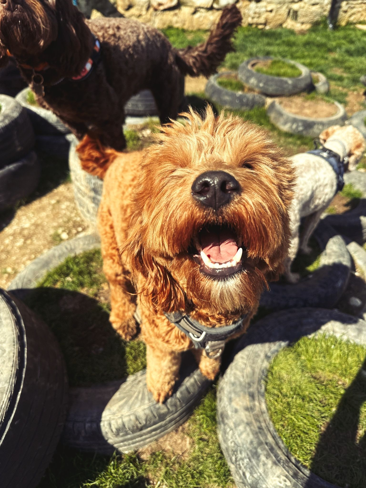
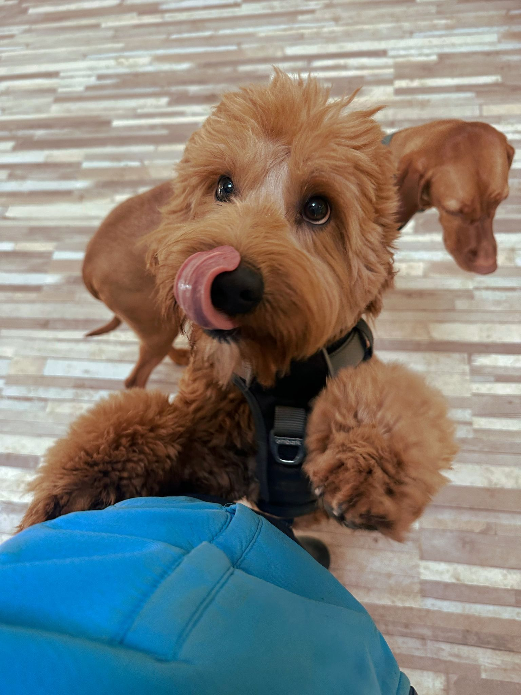
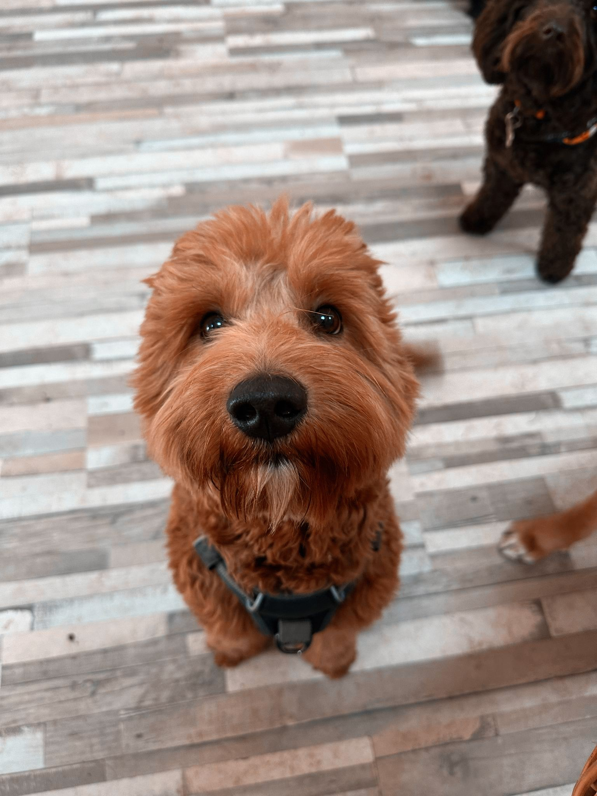

## The Allure of a “Guaranteed” Trained Dog

It’s tempting: a trainer promises to “fix” your dog’s behaviour in just a few sessions — or your money back. For owners feeling frustrated or desperate, that guarantee can feel like a lifeline.

But here’s the truth: dogs are living, thinking, emotional beings. They’re not factory machines that can be “reprogrammed” with absolute certainty. Every dog has its own personality, history, and learning pace. And because of that, there simply can’t be genuine guarantees in ethical dog training.

## Archie’s Story: Why Real Dog Training Isn’t an On/Off Switch

Archie was a beautiful young Labradoodle — all curls, big eyes, and an infectious zest for life. But behind that teddy-bear exterior, he was struggling.

Archie had severe separation anxiety, which meant he panicked whenever left alone. He also had hormone-driven humping during play and found it nearly impossible to regulate his emotions around other dogs. The moment he saw one, his excitement spiked, hormones surged, and that overflow of energy quickly turned into frustration — and from there, into reactivity.

When Maria, Archie’s mum, brought him to us, she hoped we could “fix” these issues and return him as a happy, calm, perfectly behaved dog — as if we could simply flip an on/off switch.

We explained that we use positive reinforcement training, a humane and science-based approach that focuses on teaching emotional regulation, building coping skills, and rewarding the behaviours we want to see. This isn’t about suppressing behaviour; it’s about reshaping it for the long term.

Archie responded beautifully during sessions — learning to check in with his handler, redirect his focus, and manage his impulses better over time. But progress in the training room is only half the story. The other half happens at home.

Unfortunately, Maria found positive reinforcement “too much work” to apply consistently. She wanted a quick turnaround: a dog who could go away for training and come back “fixed”. What she didn’t realise was that our role as trainers is to start the process, lay the foundation, and guide the family — not to replace the family’s role entirely.

Without daily follow-through, training plateaus. Without consistency, progress fades. And without the owner’s active participation, a dog like Archie can’t truly become the well-rounded, confident companion he has the potential to be.

## The Hidden Problem with Guarantees

When a trainer promises results and their initial methods don’t work, they’re faced with a choice:

- Admit the method is failing, or
- Escalate the punishment to force compliance.

Too often, option two is chosen. This might mean:

- Increasing the intensity of electric collar shocks
- Applying harder leash corrections with a choke chain or prong collar
- Using more frequent or prolonged corrections

The mindset becomes, “If the dog isn’t falling in line, it must need a bigger consequence.”

The result? More pain, more fear, and more risk to the dog’s physical and emotional health — all to uphold a promise that should never have been made in the first place.

## How Aversive Training Tools Work — and the Injuries They Can Cause

Aversive training tools are designed with one primary goal: to stop unwanted behaviour by applying discomfort or pain.

They don’t teach the dog what to do instead, but rather make the current behaviour unpleasant enough that the dog chooses to avoid it in the future.

The problem?

Dogs don’t just “switch off” behaviours — they make associations.

And if those associations link pain to other dogs, people, or even the owner, they can create lasting fear, anxiety, or aggression.

Let’s break down each tool in detail:

### 1. Choke Chains

How they work:

- A choke chain is a loop of metal links that slides through one end to create a slip collar.
- When tension is applied to the leash (either by the handler or the dog pulling), the collar tightens around the dog’s neck.
- The tightening continues until the pressure is released — meaning the only “reward” for the dog is the removal of discomfort.
- There may be a treat thrown afterwards; however, that is not the reinforcement, as the release of pressure will have a higher value than the treat.

Why trainers use them in guarantee-based programs:

- Choke chains can stop pulling or lunging quickly because they cause an immediate aversive sensation.
- The dog learns that pulling results in neck compression, so the behaviour is suppressed.

#### Physical risks:

- Tracheal damage — constant tightening can damage the windpipe.
- Oesophageal bruising — internal injury to the oesophagus.
- Neck sprains or spinal injury — sudden jerks can strain neck muscles or vertebrae.
- Increased eye pressure — dangerous for dogs prone to glaucoma or eye conditions.

Psychological impact:

- Creates negative associations with whatever the dog sees during the correction (e.g., another dog).
- It can increase anxiety, especially in sensitive or fearful dogs.

### 2. Prong Collars

How they work:

- Prong collars consist of metal links with inward-facing prongs that rest evenly around the dog’s neck.
- When the leash tightens, the prongs press into the dog’s skin, distributing pressure across multiple points.
- The sensation is meant to mimic a “bite” from another dog, but in reality, it’s a mechanical pinching of the skin and underlying tissue.

Why trainers use them in guarantee-based programs:

- Prong collars are seen as more “controlled” than choke chains because they don’t slip continuously — but they still create discomfort strong enough to stop behaviour quickly.

#### Physical risks:

- Puncture wounds or skin abrasions from repeated pressure.
- Bruising and swelling around the neck.
- Nerve damage — prolonged use can damage nerves, leading to neck sensitivity or even partial paralysis in extreme cases.
- Muscle tension — chronic stiffness from repeated pinching.

Psychological impact:

- It can cause fear-based reactivity if the dog associates the pain with specific triggers (like other dogs, cyclists, or strangers).
- Often increases aggression in already frustrated or defensive dogs.

### 3. Electric Collars (E-Collars)

How they work:

- E-collars deliver an electric pulse via contact points on the dog’s neck.
- The handler uses a remote control to deliver a shock when the dog performs an undesired behaviour.
- The intensity can range from a mild tingle to a strong, painful jolt — but even “low-level” shocks can be aversive, especially for sensitive dogs.

Why trainers use them in guarantee-based programs:

- Shocks can be delivered at a distance, making them appealing for “off-leash control” or recall training.
- They suppress unwanted behaviours very quickly, allowing the trainer to meet their promised “results.”

#### Physical risks:

- Burns or lesions at the contact points from prolonged wear.
- Skin infections where the prongs rub or irritate.
- Heart rate spikes — electrical stimulation triggers a physiological stress response.

Psychological impact:

- Strong potential for fear-based aggression — the dog may associate the shock with whatever was present when it occurred.
- Learned helplessness — the dog shuts down completely, becoming passive to avoid any risk of pain.
- It can severely damage the dog-owner relationship, as the handler becomes associated with unpredictable discomfort.

### Key takeaway:

While these tools can create quick “obedience,” it’s obedience based on fear and avoidance, not understanding and trust.

In dogs like Archie — already prone to emotional overwhelm — the use of these methods risks making the underlying issues worse, and in some cases, creating aggression where there was none before.

### Why Ethical Trainers Don’t Offer Guarantees

A dog’s emotions, genetics, and past experiences all shape how they respond to training.

Owners’ follow-through is essential for maintaining and progressing results.

True behaviour change is a gradual process, not a few-week transformation.

That’s why ethical trainers avoid guarantees — because real, welfare-first dog training requires patience, commitment, and adaptability.

### Positive Reinforcement: The Long Game

Positive reinforcement training rewards desired behaviours and sets dogs up for success by managing their environment. This method:

- Builds trust between dog and human
- Encourages learning and problem-solving
- Supports emotional regulation and resilience
- Creates a stronger bond without fear-based control

But there’s no “instant fix.” Especially for dogs like Archie with emotional or hormonal influences, it can take months of consistent work at home and in training sessions.

The beauty of this approach is that results are lasting — because the dog learns what to do, not just what to avoid.

### Who Guarantees Attract

Guarantee-based trainers tend to attract owners who:

- Prioritise speed over welfare
- Want to “get the dog in line” rather than nurture cooperation
- Prefer image in public over nurturing cooperation

This is a minority mindset. Most modern dog guardians value trust, empathy, and partnership, seeing training as a shared journey.

### Final Thoughts

Archie’s story is a cautionary tale. Positive reinforcement training can work wonders, but only when owners commit to the process. Choosing quick-fix, aversive methods might deliver instant results, but it risks creating long-term problems — including turning a non-aggressive dog into an aggressive one through fear and frustration.

The only guarantee worth making in dog training is this: if you put in the work with patience, empathy, and consistency, your dog will grow into the best version of themselves — and so will your bond together.

## FAQ

1. **Why can’t trainers guarantee results?**

   Because dogs are individuals, and their progress depends on many variables — including owner involvement and the dog’s emotional state and how long the emotional state has persisted.

2. **How do choke chains, prong collars, and e-collars work?**

   They apply discomfort or pain to stop unwanted behaviour, which suppresses but doesn’t teach.

3. **Are aversive tools dangerous?**

   Yes — they can cause physical injury, fear, and long-term anxiety, in most cases leading to aggression.

4. **How long does positive reinforcement take?**

   It varies — some dogs progress quickly, while others, especially with emotional challenges, take months or more.

5. **Can positive reinforcement guarantee a perfectly behaved dog?**

   No — but it can build lasting skills, confidence, and trust that lead to a happier, more balanced dog.
