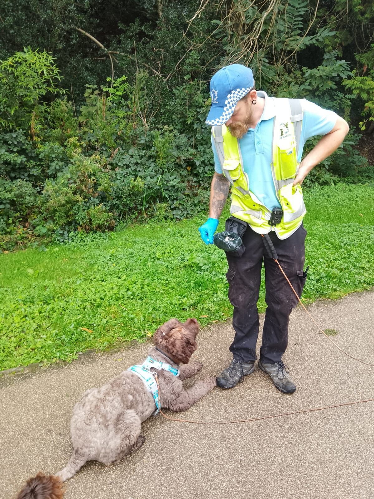

## Why the Fairy Tails Board and Train Programme is Your Dog’s Best Path to Success

In today’s busy world, many dog parents struggle to dedicate the necessary time and energy to properly train their dogs. Life commitments often make it difficult to maintain the consistency and structure that effective dog training demands. This is where board and train programmes come into play. These intensive dog training courses provide an opportunity to outsource the training to professionals who have the experience, time, and resources to focus entirely on your dog’s development.

At The Fairy Tails, our board and train programme is designed to deliver effective, long-lasting results, but it's important to understand that no training method is a magic solution. The success of any dog training regimen is dependent on several factors, and while our trainers at The Fairy Tails are experts in their craft, results will always be influenced by a variety of elements unique to each dog.

## The Importance of Consistency and Repetition in Training

One of the most significant benefits of a board and train programme is the ability to provide consistency and repetition in a controlled environment. At The Fairy Tails, we focus on training behaviours that can be reinforced over time, allowing your dog to build strong associations between commands and actions. Through consistent practice, certain behaviours become muscle memory, transforming learned commands into natural responses.

While this repetition helps instil good habits, it’s crucial for dog parents to understand that training requires ongoing commitment. When your dog returns home, it’s important to maintain the techniques we’ve instilled during their time with us. Without ongoing reinforcement at home, even the best board and train programmes can see their effectiveness diminish over time.

## The Key Factors That Influence Training Success

Dog training is never one-size-fits-all. At The Fairy Tails, we know that there are many factors that influence how quickly and effectively a dog responds to training. These factors can vary from dog to dog and include:

- Dog’s health: A healthy dog is more likely to respond well to training. Any underlying health issues, such as pain or discomfort, can impede a dog’s ability to focus and learn.
- Home life: The environment in which the dog lives plays a huge role in behaviour. A stable, calm home will help the dog feel secure and open to learning.
- Routine: A dog that follows a predictable daily routine is more likely to adapt well to new training.
- Dog’s parent and their personality: The personality of the dog parent matters more than you might think. A calm, patient, and consistent parent will see better results than one who is frustrated or inconsistent.
- Early socialisation: Dogs that have been well-socialised from a young age tend to adapt more easily to training and are less likely to develop anxiety- or fear-based behaviours.
- Maternal influences: A dog’s behaviour can be influenced by the temperament and behaviour of their mother, particularly if there were any stress factors during pregnancy.

By taking all of these various factors (to name a few above) into account, we at The Fairy Tails are able to tailor our training approach to each dog, ensuring the best possible outcome for both the dog and their parents.

## Why Punishment-Based Training Methods (inflicting pain) Should Be Avoided

There are various dog training methods out there, but not all of them are beneficial in the long term. Punishment-based training is often seen as a quick fix, but it can come with significant drawbacks.

At The Fairy Tails, we prefer to focus on reward-based training, as it leads to healthier, more confident dogs. Punishment-based methods may produce fast results, but they often result in an anxious, fearful dog. Over time, these dogs can become aggressive as a result of their anxiety. The punishment creates a negative association with learning, causing the dog to feel stressed and apprehensive about commands or situations.

Reward-based training, on the other hand, fosters a positive learning environment. This approach encourages dogs to repeat good behaviour because they associate it with positive reinforcement, such as treats or praise. While it may take longer to see results, the outcomes are much more sustainable, as your dog learns to make positive choices rather than responding out of fear. A dog trained with rewards is also less likely to develop aggressive tendencies, leading to a more harmonious relationship between the dog and their family.

## The Benefits of Rule-Based and Guided Training

While we advocate for reward-based training, it’s equally important to understand that rule-based training and guidance are key components of a well-rounded training programme. Some dog parents worry that setting boundaries or rules may be too restrictive for their dogs, but in reality, it provides a sense of clarity and security that helps them thrive.

At The Fairy Tails, we create a balanced environment where your dog is gently guided to learn important life skills through structure and consistency. Our approach ensures your dog feels safe and confident, knowing what is expected in different situations. Clear, caring boundaries help your dog feel at ease, understanding their role within the family and fostering a stronger, more harmonious relationship between you and your pet.

## Safety First: Our Approach to Training

At The Fairy Tails, we believe in a safety-first approach to training. This means that while we incorporate positive reinforcement, we also prioritise the safety of both the dog and their environment at every stage of the process. Ensuring rules, structure, and control helps maintain a secure and supportive atmosphere where dogs can thrive without risk. Training a dog is never about shortcuts or “magic” fixes; it’s about consistency, repetition, and always considering the safety and well-being of the dog. Our board and train programme is designed to provide long-lasting results that help your dog become a well-rounded, confident companion while keeping safety as the top priority.

## Avoid the False Promises of “Magic” Training Methods

In recent years, there has been a growing trend of “one bullet” training methods, which are often marketed as a magical solution for dog behaviour issues. While some techniques can be beneficial, it’s important to understand that not all of these methods are practical or effective in the long term, as behaviour is ever-evolving and growing.

At The Fairy Tails, we believe in a rule-based positive approach to training. This means incorporating positive reinforcement while also ensuring that rules and structure are part of the process. Training a dog is never about shortcuts or “magic” fixes; it’s about consistency, repetition, and ongoing reinforcement. Our board and train programme is designed to provide long-lasting results that help your dog become a well-rounded, confident companion, not a temporary solution based on fleeting trends.

## Conclusion

The Fairy Tails board and train programme offers a proven, effective solution for dog parents who need support in training their dogs. By focusing on consistency, repetition, and a balanced approach to discipline and reward, we help dogs develop positive behaviours that will last a lifetime.

Dog training is not about finding quick fixes or magical methods—it’s about understanding the individual needs of each dog and working with them in a structured, supportive environment. If you’re ready to see your dog thrive, contact The Fairy Tails today to learn more about our board and train programme.
