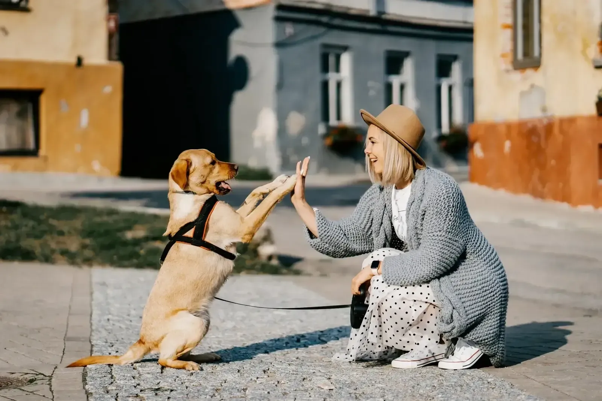

### Building relationships

#### 7 core emotions that you should nurture or avoid - positive (+) or negative (-):

- \+ Seeking is anticipatory behaviour.
- \+ Play creates joy and happiness and can support relationship building and positive associations.
- \+ Lust is about social encounters for reproduction, often driven by hormones.
- \+ Care is about safety and trust, and the relationships we build with our dogs.
- \- Rage is anger, frustration leads to anger and rage.
- \- Fear will trigger fight-or-flight responses.
- \- Panic/grief will trigger fight and flight responses.

#### What we want versus what the dog wants

A good relationship requires knowing what you want as a handler and what the dog wants as a dog. Plan training for mutual benefit, combining the two.

Dogs usually want food, affection, and play. If done right, play can be a powerful reward. Finding out what motivates your dog and how to encourage him to play is crucial to building a good relationship.

However, play increases arousal, so encouraging the dog to be still, focused, and controlled in order to play again reinforces the behaviour you want. Games can teach self-control, impulse control, and frustration skills while keeping the dog and handler entertained.

#### Why relationships break down

##### Two main causes of relationship breakdown are: Frustration and abandonment.

##### Abandonment

This happens when a dog is left alone when he is stressed or scared. Support from people helps dogs get over their fears. If you leave a dog when he can't handle things, all he learns is how not to handle things. There's a balance between making a dog strong and being there for him when he needs you.

It's easy for humans to put pressure on our dogs when training, but this is usually bad for the relationship we're trying to build.

##### Frustration and over-arousal

Over-excited dogs can't think. If thwarted, they can become agitated and enraged.

It's often recommended to overlook a dog's "bad" behaviour and wait for him to behave properly. If the dog is likely to behave well and receive a lot of reinforcement, this can solve certain training issues. In contrast, if the "wrong" behaviour surpasses the "good," there are few reinforcement chances and long periods without reinforcement.

The dog becomes increasingly frustrated and associates that feeling with you. Here, a handler must apply both guided and unguided learning, such as lure and reward and shaping. Both of these methods—or a combination of both—can help individual dogs in specific situations.

#### Providing emotional support

We need to support dogs as they learn and develop the independence to manage their own behaviour. There are many situations where a dog might not be able to help himself. However, you can support him and help him develop resilience, confidence, and impulse control.

Resilience helps dogs cope with new, unexpected, and stressful situations. Resilience matters. No matter how socialised a puppy is, some situations will scare him. He has to rehabilitate so these negative experiences don't affect him.

#### Games for relationship building

##### Fun with your dog builds relationships! Working together in a good mood is fun, stimulates learning, and helps you bond.

##### Casual retrieve

This game rewards training with the retrieve. The dog's inherent desire to chase the toy is linked to control since he must follow the game's rules. It also teaches the dog to give up objects readily, preventing thieving and resource guarding.

##### Hesitant retrievers

Use two toys to play this game with dogs who don't want to give up the toy. Make sure they are equal or identical.

##### Playing tuggy

You can play tug, but you have to "win" to show that you are the pack leader. It's a game for two users on a team. So, it's great for making connections and building relationships.

##### Building value (in some cases only)

When a dog has easy access to a toy that has been left lying around, the item loses its appeal. The fact that the dog has limited access to it raises its worth, as well as the dog's motivation to earn it – if the dog is not motivated.
