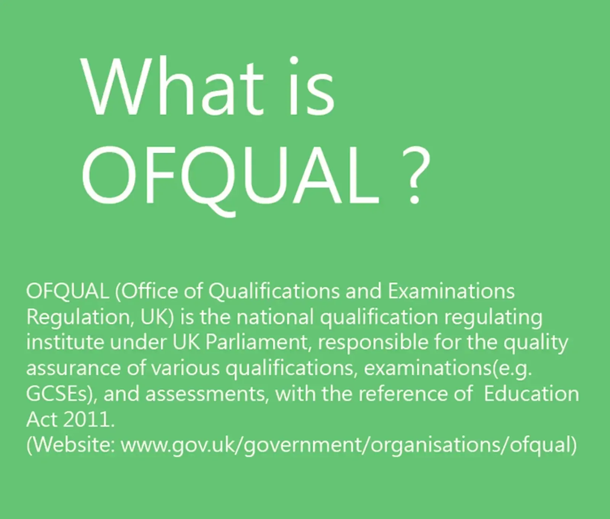

### Am I a qualified, accredited, registered, approved, certified, and listed dog trainer?

### What does it mean?

### Debunking the social media fad.

#### Why aren't Office of Qualification (OFQUAL) registered dog training courses offered by dog training education providers?

Dog training is an important aspect of pet ownership, and many pet owners look for professional help to train their dogs. In England, the dog training industry has grown rapidly, but many education providers have yet to offer OFQUAL-registered courses despite this growth. In this blog, we will explore some of the reasons why this is the case and, furthermore, explore the possibility of regulating the profession once we have OFQUAL standard education.

**Lack of Recognition:** One of the reasons why dog training education providers are not offering OFQUAL-registered courses is that the industry is not yet recognised as a formal profession. This lack of recognition means that there is no clear framework for regulating dog training courses, making it difficult for education providers to offer OFQUAL-registered courses. Therefore, it is difficult for businesses to make a sound investment in their staff's qualifications.

**Cost:** Another reason why dog training education providers are not offering OFQUAL-registered courses is the cost involved. To become an OFQUAL-registered provider, education providers must meet strict standards and go through a rigorous accreditation process. This process is costly and time-consuming, and many education providers may be unwilling to invest the resources required to offer OFQUAL-registered courses.

**Lack of Awareness:** Another reason dog training education providers are not offering OFQUAL-registered courses is that many pet owners may not know the importance of working with a trainer with an OFQUAL-registered education background. This lack of awareness means that pet owners may not understand the benefits of working with OFQUAL-registered trainer courses and may not be willing to pay a premium for this level of training. On the other hand, dog grooming is an OFQUAL-registered course, which has changed the profession without increasing the cost burden on consumers.

**Diversity of Training Methods:** Finally, the diversity of training methods used in the dog training industry is another reason why education providers are not offering OFQUAL-registered courses. There are many different approaches to training dogs, and each approach may have its own unique qualifications and certifications. This diversity makes it difficult for education providers to offer a single, unified, OFQUAL-registered course that covers all of the different training methods. However, there is nothing to stop the education providers from providing courses unique to the skill set they aim to develop. These unique courses can be registered in their own right to diversify the industry.

**Establishing Industry Standards:** Currently, there are no set standards due to education providers' refusal to offer OFQUAL-registered courses, which should bring uniformity to the industry. The first step in regulating the dog training industry in England is establishing industry standards through the OFQUAL route, using the dog grooming industry as a template. These standards should cover training methodology, qualifications, and facilities. It will ensure that all dog trainers provide the same quality service, regardless of location or affiliation. It will drive down the cult-like mentality among trainers and their consumers.

**Licensing Requirements:** The next step is introducing licencing requirements for dog trainers in England. This will help to ensure that only OFQUAL-qualified and experienced trainers are providing training services. The licencing requirements should include a minimum level of training and experience and regular continuing education requirements to ensure that trainers stay up-to-date with the latest research. Licensing requirements can use the dog daycare industry as a template, which has transformed the dog daycare landscape. The star rating from dog daycare is another example of the benefit of using experience and CPD as a baseline to advance towards a 5-star rating.

**Regular Inspections:** To ensure that dog training facilities (such as village halls or training centres) are meeting the established industry standards, regular inspections should be conducted to ensure basic safety protocols such as written exercise action plans, fire safety, first aid coverage, emergency safety protocols, risk assessments, and meeting other health and safety standards. Similar inspections can take place on one-on-one dog training visits, where inspectors can accompany a trainer on a visit to the client's property to assess the safety standards. The results of these inspections should be publicly available to help pet owners make informed decisions when choosing a dog trainer, which local councils can manage.

**Accreditation businesses (commonly operate as "gateway businesses"):** Where there is an opportunity to make money, someone will grab it, and that is how entrepreneurs shine. It begs the question: if other businesses can ordain dog trainers to be the noble knights of the dog training world, then why is there so much disagreement? Why can't we all become noble knights with the armour of accreditation behind us? The answer lies somewhere between public law and private law. All public bodies are regulated through public law or administrative law. Therefore, there are plenty of safety switches and mechanisms to ensure the sanctity of legal obligations is protected. You can even sue public bodies for not doing their job, i.e., not protecting consumers. On the other hand, companies or businesses operate through the law of contract in private law. The law of contract is not only flexible, but it also depends on one's creativity and genius to make it work and create a smooth transaction. In contracts, the only remedy is often actual damages where there is a causality. Third parties are often excluded from claiming any damage. Consumers have zero protections against these gateway businesses, where contracts only exist between gateway businesses and trainers. Consumers only get to see the logos and badges, which are not helpful if you are trying to claim damages.

Moreover, who is looking after the conduct of gateway business? Public bodies are scrutinised by the public, but who scrutinises the conduct of gateway businesses that claim to uphold ethics or standards?

**Transparency is built into public law, whereas privacy is the bedrock of private law—something to think about.**

**In conclusion,** the dog training industry in England is growing rapidly, but many education providers have yet to offer OFQUAL-registered courses. The reasons for this include the lack of recognition for the industry as a formal profession, the cost involved in becoming an OFQUAL-registered provider, a lack of awareness among pet owners, and the diversity of training methods used in the industry. To encourage education providers to offer OFQUAL-registered courses, it will be important to increase recognition of the industry as a formal profession, to raise awareness among pet owners about the importance of working with an OFQUAL-registered provider, and to create a more unified framework for the regulation of dog training courses. Regulating the dog training industry in England is equally essential to ensuring that pet owners receive high-quality training services and that their dog trainers are safe. By establishing industry standards and licencing requirements, conducting regular inspections, implementing consumer protection measures, and promoting education and awareness, the dog training industry in England can be regulated effectively.

For now, badges are the new normal and have become fashion accessories for dog trainers to flaunt around on social media, and the more, the better, is a modern mantra. So, dog trainers are now in a mad rush to add more badges to their promotions instead of giving their customers more value. Many dog trainers now belong to a cult rather than science and engage in character assassination instead of an intelligent or eloquent debate.
