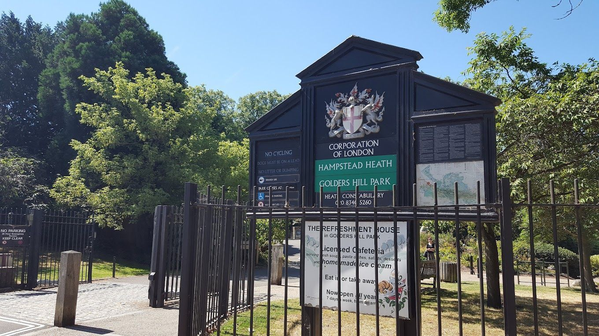
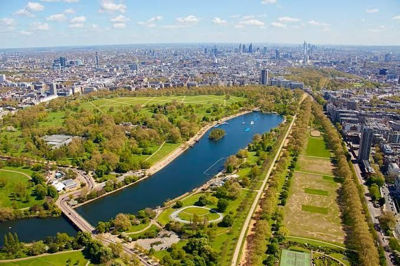
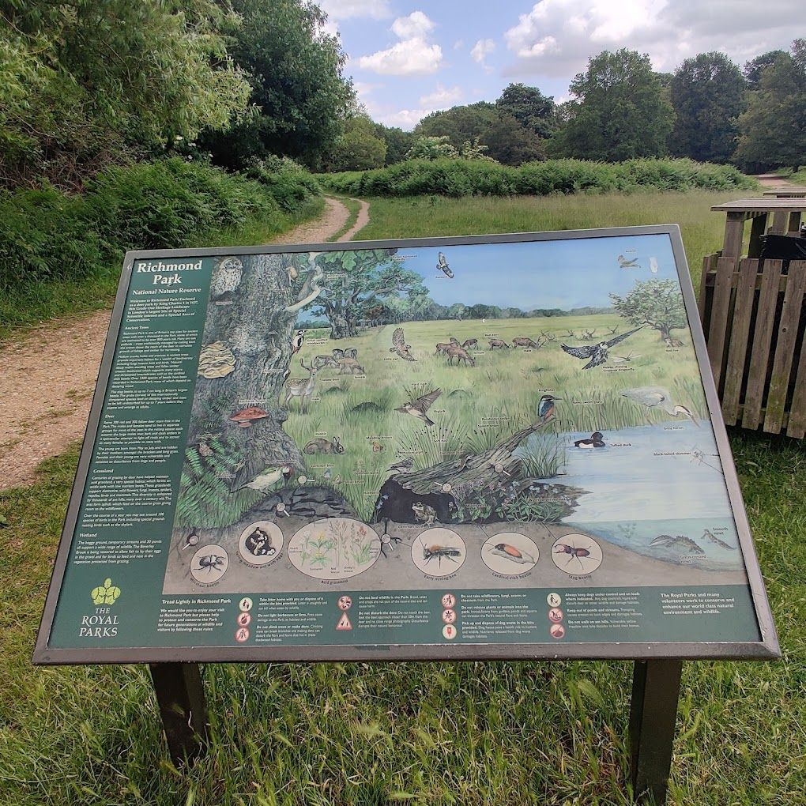
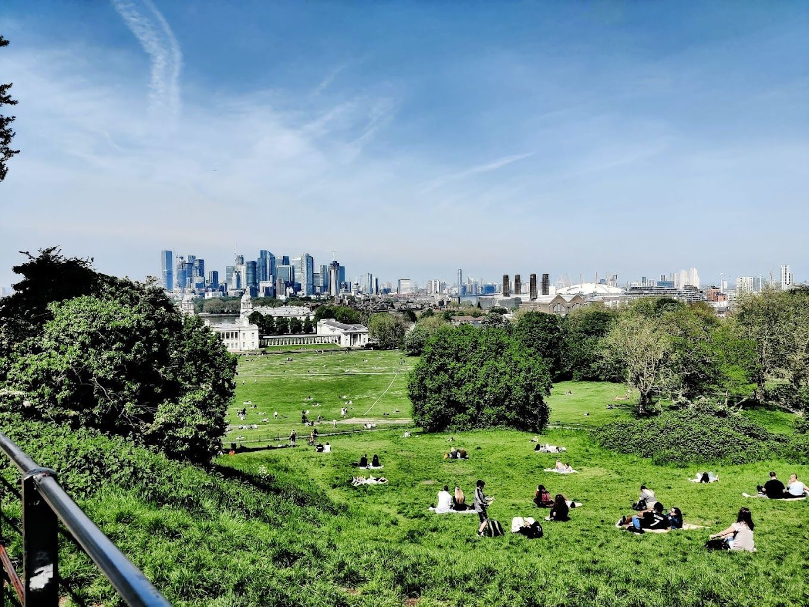
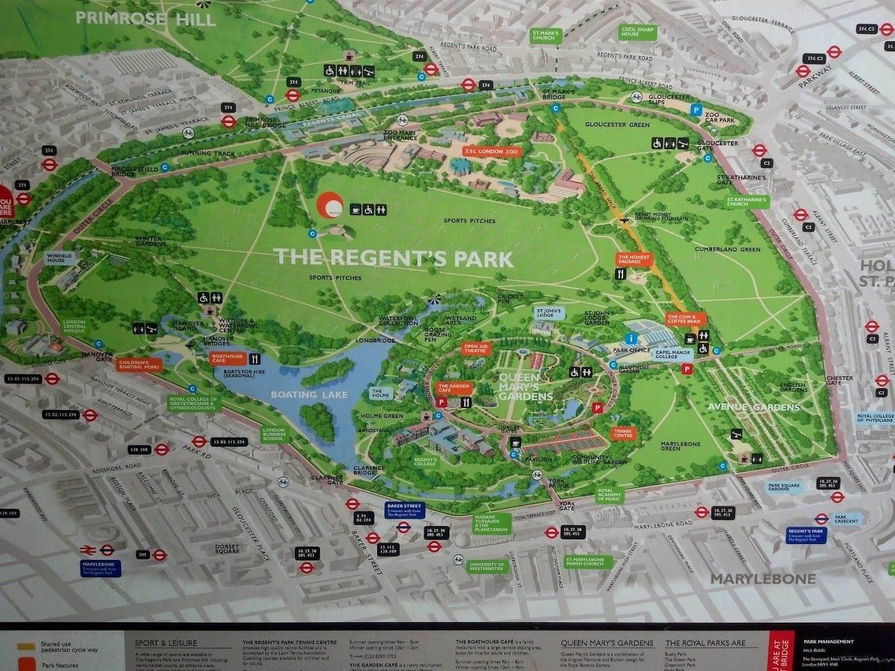
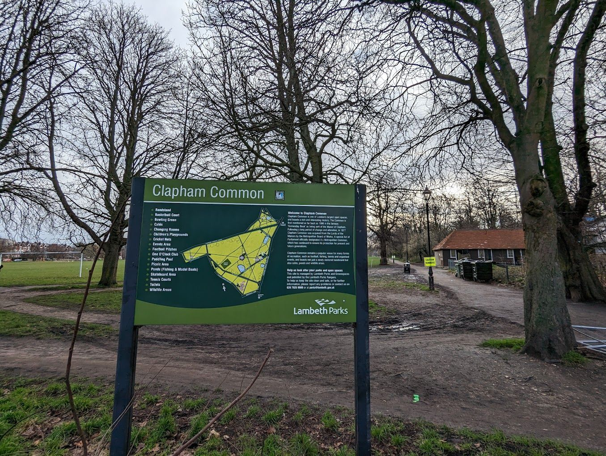
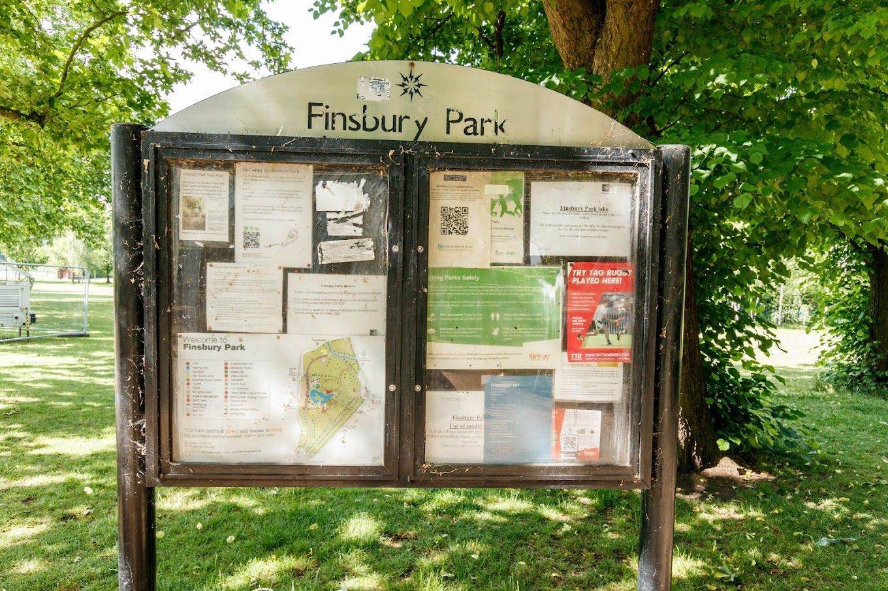

### Embark on an Exciting Journey to London's Top Dog Parks!

Hey, dog lovers! Amidst London's bustling areas lies a world of joy for our furry friends. This guide dives into the best 10 dog parks in the city, each a haven of lush greenery and jolly freedom. Perfect for locals and visitors, these parks offer unforgettable adventures for all dog breeds. So, grab your leash and let's uncover London's dog-friendly gems!

## LONDON'S TOP DOG PARKS

### 1. HAMPSTEAD HEATH DOG PARK

Where: Hampstead Heath, NW3

Highlights: A vast 790-acre landscape in North London, known for its diverse terrain and ancient woods. Dogs enjoy off-leash freedom and water play in ponds. It's a social hotspot for dog meet-ups.

Main Attractions:

- Expansive open areas and woodlands
- Dog-friendly swimming spots
- Frequent social events for dogs

### 2. HYDE PARK’S DOG AREA

Where: Hyde Park, W2

Highlights: Among London's Royal Parks, Hyde Park is a canine-friendly spot. The Dog bowl area is a buzzing canine play zone. Winding Lake and dog-friendly cafes add to its charm, especially on busy weekends.

Main Attractions:

- Special off-leash area
- Dog-welcoming cafes
- Close to major landmarks for a complete outing

### 3. BATTERSEA PARK DOG AREA

Where: Battersea Park, SW11

Highlights: Along the River Thames, this park is a peaceful haven with shaped gardens and paths. Ideal for training or relaxing walks by the river.

Main Attractions:

- Beautifully landscaped gardens and riverside paths
- Close to the Thames for stunning vistas
- Spacious for training and playing

### 4. RICHMOND PARK

Where: Richmond, TW10

Highlights: London's largest Royal Park, offering diverse landscapes from open spaces to wildlife areas, home to Richmond deer. A favourite for its natural variety.

Main Attractions:

- Expansive open areas and diverse terrains
- Wildlife encounters, including deer
- Numerous trails for exploration

### 5. VICTORIA PARK

Where: Tower Hamlets, E3

Highlights: Known as 'Vicky Park', this East London favourite boasts two dog-friendly cafes and a scenic lake, hosting dog events year-round.

Main Attractions:

- Dog-friendly cafes
- Regular community events for dogs
- Scenic lake and open play areas

### 6. GREENWICH PARK

Where: Greenwich, SE10

Highlights: Offers stunning London skyline views. Famous for its historical significance, it's perfect for walks or picnics with dogs.

Main Attractions:

- Breath-taking city views
- Historical sites like the Royal Observatory
- Large off-leash areas

### 7. REGENT’S PARK

Where: NW1

Highlights: Renowned for landscaped gardens and sports facilities, this park offers varied terrain and views from Primrose Hill. Near the London Zoo.

Main Attractions:

- Diverse landscapes and gardens
- Primrose Hill for city panoramas
- Close to London Zoo and other attractions

### 8. CLAPHAM COMMON

Where: Clapham, SW4

Highlights: A lively South London spot with three ponds and open spaces for a range of activities, perfect for water-loving dogs.

Main Attractions:

- Water features for dogs
- Spacious areas for exercise
- Vibrant community atmosphere

### 9. FINSBURY PARK

Where: Harringay, N4

Highlights: A mix of open spaces and woods, with a dog-friendly café. It also has an art gallery and a boating lake.

Main Attractions:

- Diverse terrain for walks
- Café for dog owners
- Cultural attractions like an art gallery and lake

### 10. TRENT PARK

Where: Enfield, EN4

Highlights: A tranquil North London park with extensive woodland trails and a large lake, ideal for serene, nature-filled walks.

Main Attractions:

- Quiet woodland paths
- Scenic lake for walks
- Peaceful, less crowded setting

A few more to list:

- Alexandra Park and Palace
- Fryent Country Park
- Roe Green Park
- Hackney Marshes
- Clissold Park
- Acton Park
- Ravenscourt Park
- Kennington Park
- Burgess Park
- Ruskin Park

London's array of dog parks caters to every dog, from water enthusiasts to explorers. Each park's unique charm makes for memorable moments with your pet. Remember to respect the park rules and the environment. Discover why London is not just for humans but a playground for dogs too!

Call us on 01424 300668 for expert dog training guidance. Our professional trainers ensure your dog's safety and wellbeing. Learn why we're the UK's top dog trainers on our website, [www.thefairytails.co.uk](/).

For cute dog photos and videos, check out our Facebook and Instagram. Our [Google 5-star reviews](https://www.google.com/search?q=fairy+tails+hastings&sca_esv=591697910&sxsrf=AM9HkKlhdTZL5yhLFizSjqACLEBsyLKu2A%3A1702839715972&ei=o0V_ZfjtOvGZhbIPiuWh0Ag&ved=0ahUKEwi4y4SjlJeDAxXxTEEAHYpyCIoQ4dUDCBA&uact=5&oq=fairy+tails+hastings&gs_lp=Egxnd3Mtd2l6LXNlcnAiFGZhaXJ5IHRhaWxzIGhhc3RpbmdzMgoQIxiABBiKBRgnMgQQIxgnMgsQLhiABBjHARivATILEAAYgAQYigUYhgMyCxAAGIAEGIoFGIYDMgsQABiABBiKBRiGAzILEAAYgAQYigUYhgMyGhAuGIAEGMcBGK8BGJcFGNwEGN4EGOAE2AEBSMwXUOYBWKMUcAF4AZABAJgBsAGgAYEKqgEDNC43uAEDyAEA-AEBwgIHECMYsAMYJ8ICChAAGEcY1gQYsAPCAg8QABiABBiKBRhDGLADGArCAgcQABiABBgKwgIQEC4YgAQYFBiHAhjHARivAcICBRAAGIAEwgIKEAAYgAQYFBiHAsICCxAAGIAEGIoFGJECwgIHEC4YgAQYCsICHxAuGIAEGBQYhwIYxwEYrwEYlwUY3AQY3gQY4ATYAQHCAg0QLhiABBjHARjRAxgKwgIGEAAYFhge4gMEGAAgQYgGAZAGCroGBggBEAEYFA&sclient=gws-wiz-serp) reflect our commitment to quality training.

Contact us at 01424 300668 or [info@thefairytails.co.uk](mailto:info@thefairytails.co.uk) for residential dog training. Schedule a free phone consultation on our website.

If your dog can't yet enjoy parks like these — the lunging, the pulling, the barking at every passing dog — we run [residential dog training for London dogs](/london): we [collect your dog from your door](/dog-boarding-school#london-pickup), they settle at our Sussex countryside base and train out in real, busy towns, cafés and traffic, and we bring back a dog who can handle the city.
