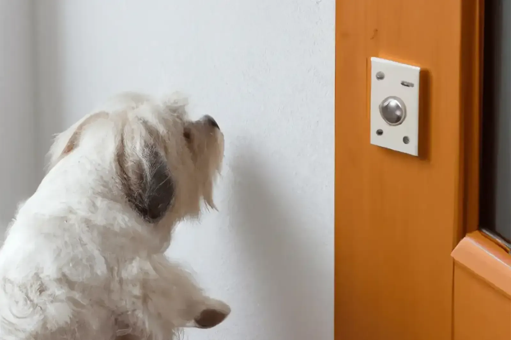

## Protocol for desensitisation and counterconditioning to noises and activities that occur by the door

Some dogs that are unable to be left alone become worried if there is any activity at the door. Some fearfully aggressive, protective, or territorial doggies will respond when someone rings the doorbell or knocks on the door. Because the reaction level at the door is a crucial factor in the dog's escalating anxiety, clients must frequently work independently on desensitising and counterconditioning the dogs to noises and activities at the door. This protocol is intended to assist you in teaching your dog to relax and remain calm in such situations. As with the other protocols, you should have finished "Protocol for Basics and Relaxation" before proceeding.

Place the dog in the middle of the room, with its side towards the door. This enables the dog to utilise its peripheral vision without drawing its full focus to the entrance. It is ideal to practise this protocol with two individuals: one as the rewarder and the other as the stranger. Initially, it is optimal if the stranger is someone the dog is comfortable with.

The purpose of the protocol is to teach the dog to relax in response to a cue, regardless of who is at the door. Some individuals prefer allowing the dog to bark once or twice as a warning before remaining quiet. This may be conceivable, but for some dogs, simply reacting to this brief exposure may trigger a cascade of undesirable and inappropriate behaviour. It is not enough for the dog to be sitting or sleeping peacefully; it must not exhibit any bodily indicators of physiological stress (shaking, trembling, panting, salivating, increased heart rate, averted gaze, frequent eye movements, and so on). Relaxed animals can learn, and animals who find the tasks enjoyable learn more quickly.

When the dog is relaxed and sitting or lying down, encourage the stranger to continue knocking softly and briefly (see the task list). Before practising with the dog, you should review the plan with the stranger so that you can communicate without confusion. This helps to prevent dog anxiety. As soon as you hear or anticipate hearing the knock, cue your dog to look at you. As soon as it looks at you, praise it with "Good boy (girl)!" and give it a treat. You can treat the dog if it glances briefly at the door but does not otherwise appear distressed and either spontaneously returns its gaze to you or responds to a mild signal from you (pursing your lips, clearing your throat, etc.). If the dog reacts or stares at the door, call the dog to you while moving away from the door and knocking more softly. If this fails and the dog continues to respond, remove the dog from the room, practise some exercises from basics protocols when the dog is calm enough to do so effectively, and try again with a softer knock and greater space between the dog and the door. Use of phone to communicate with the friend is advisable.

If you must finally remove the dog from the room, you will be most effective if you can do it verbally. If your dog does not respond to a verbal instruction to "come" when it is agitated, you will need a lead to bring it to a more appropriate place. If you continue to work with the dog when reacting, it will eventually learn to associate the vocal command with the lead direction, allowing you to gradually work off-leash. To correct incorrect door behaviour, you can use a long-distance leash as long as you are with the dog.

You can also use the ring doorbell or any other chime, which can be controlled by your phone or a secondary button in your pocket, and begin with the volume set to a very low level. Use a mat as a marker to sit/relax. Repeat each step as long as required.

- Ding dong or ring = treats

- Ding dong or ring = Sit + treats

- Ding dong or ring = Sit + Down + treats

- Ding dong or ring = Sit + Down + time delay + treats

- Ding dong or ring = Sit + Down + time delay + Door opening + treats

- Ding dong or ring = Sit + Down + time delay + Door opening + time delay + treats

- Ding dong or ring = Sit + Down + time delay + Door opening + repeat bell noise + treats

- Ding dong or ring = Sit + Down + time delay + Door opening + repeat bell noise + time delay + treats

As your dog's behaviour improves, raise the volume. This is also effective for dogs who react to the people on the other side of the door rather than the sounds.

The following exercises will assist you in training your dog to respond more correctly at the door. Remember that you can use a baby gate to keep the dog in a room away from the door, preventing a battle of wills at the entrance. If the dog is less agitated in gated environments, you can advance through the programme more rapidly since the dog will not continue to learn and reinforce its incorrect behaviour.

### Dog's Task

#### Dog sits and relaxes while:

- Person knocks briefly and softly Person knocks softly for 5 seconds

- Person knocks softly for 10 seconds Person knocks moderately and briefly

- Person knocks moderately for 5 seconds

- Person knocks moderately for 10 seconds Person knocks normally, briefly

- Person knocks normally for 5 seconds

- Person knocks normally for 10 seconds

- Person knocks loudly for 5 seconds

- Person knocks loudly for 10 seconds

- Person bangs on the door briefly Person bangs on the door for 5 seconds

- Person bangs on the door for 10 seconds

Anti-anxiety medications may help some dogs that otherwise are unable to succeed in this programme. Remember, if it is decided that medication could benefit your dog, you need to use it in addition to the behaviour modification, not instead of it.
