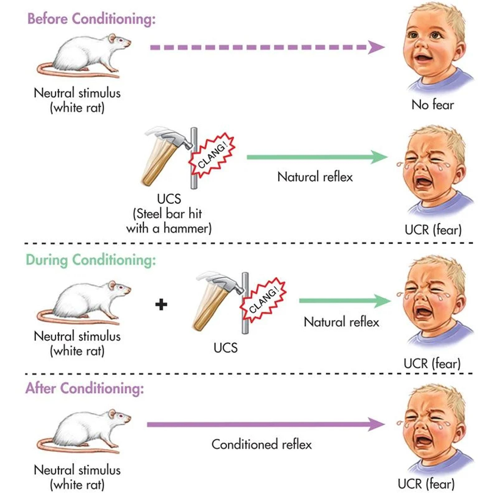
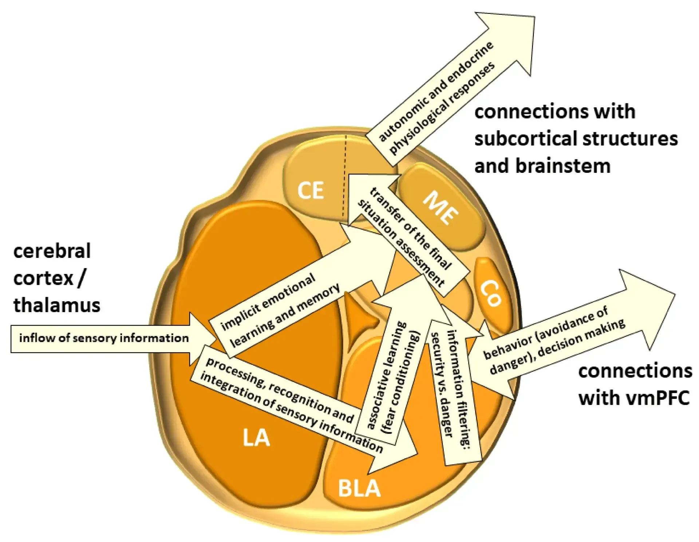

## Conditioned Emotional Response (CER) - understanding your dog

In this blog, we will be dipping in and out of the human and dog worlds at the same time since they are intricately intertwined in terms of applied behaviour science on a conceptual level.

Additionally, this blog does not consider the effect of poor socialisation at early stages of development, breed traits, chronic stress, history of training, diet, and other such issues. It will be dealt with in separate blogs.

Conditioned emotional response is also known as learnt emotional response or reaction to conditioned stimuli. American psychologists popularised the phrase "Condition-ed," which makes more sense when defining the term CER. The word CER is defined as Conditional Emotional Response in the precise translation of Pavlov's phrases from Russian to English.

### What is the mechanism of Conditioned Emotional Response?

The acquisition of a Conditioned Emotional Response follows the same premise as classical conditioning. When an organism is exposed to a certain stimulus, a physiologically meaningful event occurs, resulting in the link. Anxiety, happiness, sorrow, pain, and other emotions that an organism experiences are examples of emotional reactions. Conditioned emotional response is also known as learnt emotional reaction or response to conditioned stimuli.

All emotional reactions are regulated by the autonomic nerve system. The sympathetic nervous system, one of the two subgroups of the system (parasympathetic and sympathetic nervous systems), is responsible for the varied emotional reactions displayed by the ordinary human.

Animals, like humans, are born with a biological system that allows them to experience pleasure and pain, eliciting emotional reactions. These emotional reactions occur swiftly and automatically, with no rational thought involved.

Therefore, a CER is a learnt automatic reaction to a stimuli based on previous exposures and experiences. It is not a choice or a conscious decision; it is an emotional and instinctual reaction. This is comparable to what occurs to troops suffering from PTSD. They frequently exhibit CERs to noises that resemble explosions or shooting. If they hear fireworks, even if they are not in the setting of battle, they may experience flashbacks that induce them to react violently to the sounds. Similarly, It can also be seen in youngsters who are under exam stress.

Panic attacks, test anxiety, stage fright, and other comparable feelings exhibited when disturbed or uncomfortable are examples of the variety of emotions under CER. In "fight or flight" circumstances, the system is immediately triggered, resulting in symptoms such as elevated heart rate, perspiration, feeling weak in the knees, and other symptoms.

These emotions/reactions are acquired unintentionally or unknowingly, and they tend to linger with a person for a long time. In contrast to muscular responses, which may be noticed as early as half a second, these conditioned responses might take up to 2-10 seconds.

"All neurosis are fundamentally conditioned emotional responses," writes British psychologist Hans Eysenck (Cunningham, 1984).

### CER relies heavily on neurochemistry

Several electrical and chemical communications take place in the brain via neurons. These transmissions have an impact on how dogs and other animals, including humans, learn, memorise, feel emotions, and behave. Animals can recall past experiences and respond (without cognitive involvement) in a reflex-like manner that has proven beneficial in the past because neurons form such connections. The amygdala is involved in the processing of memory and emotional reactions. It is also known as the "brain's smoke detector." The amygdala is in charge of signalling the adrenal cortex to produce chemicals (cortisol, adrenaline) that prepare the body for fight or flight. — that bodily response – a vital component of survival – a component of self-defense – an inner desire to protect – Whatever you want to name it.

### The Classic Case

#### Experiment of Little Albert -

In 1920, John B. Watson and Rosaile Rayner performed the Little Albert Experiment. The experiment featured a 9-month-old infant, and the entire objective of the experiment was to make tiny Albert fearful.

The infant was shown a rat, to which he responded neutrally and without terror. After a while, every time the infant interacted with the rat, a loud sound was made behind his back by striking a steel bar with a hammer.

Little Albert felt frightened only by staring at the rat after repeated pairings of the rat with the sound, even when no sound was made. As a result, he developed a conditioned emotional reaction of crying at the sight of the rat.

The experiment is a typical example of CER, Conditioned Emotional Response, in which Little Albert was exposed to a specific stimuli in order to elicit a fear response. Watson, and Rayner, who were ignorant of the phrase CER at the time, assumed they were applying general conditioning principles to human behaviour in the famous experiment.

The term "CER, Conditioned Emotional Response" was coined by B.F. Skinner and William Kaye Estes. The experiment is synonymous to dogs, especially if they have anxiety or fear-based behaviour issues. It is possible that dogs might get anxious by the mere sight of the trigger, resulting in stress-induced reactivity.

It is critical to remember that CER can be positive or negative, hence +CER or -CER. Conditioning emotional responses are based on associative learning (classical conditioning). In the instance of Pavlov's dogs a bell signifies food through connections or a dog learns that a leash indicates a walk and a clicker means a treat.

### Conditioned Emotional Response Examples

CER is more frequent than most people realise. Emotional reactions developed as a result of conditioning may be found in everyday life.

#### Example 1 +CER

The scent of gasoline attracts a lot of people. In order to fully realise this, it is possible that they related it with enjoyable car journeys they took as children or motorbike rides they took as adults. As a result of this unconscious pairing, individual may develop a preference for the odour of gasoline.

#### Likewise -

Some dogs enjoy the sight of their leash; perhaps they relate it with their upbringing memories of nice and cheerful runs around the park or on the beach. Some dogs can't stop going after a tennis ball because they identify it with the adrenaline-fuelled chase that releases endorphins in the system.

#### Example 2: -CER

Consider a person who has been bitten by a dog few times. He may recall the agony of the bite whenever he encounters a dog (extreme condition). Even if the dog is only attempting to lick the human, he may feel intimidated. In countries where youngsters are more likely to be exposed to stray dogs may have a common fear of dogs.

#### Likewise -

A dog who was mistreated by people as a puppy may recall the agony of each human encounter (extreme conditioning). Even if people try to snuggle or show love and affection to the dog, he may feel threatened and snap at his handler. It may be widespread in areas where dogs are more likely to be stray.

There are several such cases in which Conditioned Emotional Response might be used to explain. A class is usually tense when a surprise exam is announced. Furthermore, a stimulus such as the fragrance of perfume may remind you of someone in your life, causing regret, laughter, or other comparable feelings.

#### Likewise –

A dog is usually nervous when a stranger pays him a visit. And, stimuli such as scents at the veterinary clinic may remind the dog of the person who stabbed (vaccinated) him, causing dread, anxiety, or similar other feelings, and the link is established.

The brain, neurological system, and endocrine system are all involved when a conditioned emotional reaction occurs.

The dog's brain is thought to operate in a "hardwired" reflex-like manner in reaction to each individual event based on earlier learning via association. This explains why standard training approaches aren't very effective in changing behaviour. We are functioning on an emotional rather than a cognitive level.

Instead, behaviour modification works because we are modifying dog's emotions through counterconditioning. As a result, one conditioned response (fear) to the same conditioned stimuli is substituted by another (Corey, 1971, p.127). The good emotional response eventually replaces the fear.

During counterconditioning, neurons are re-joined on a neuronal level, with the goal of improving the nervous system's plasticity. When we have a conditioned emotional reaction, we try to change past neural connections and transform a frightened response into a positive, pleasure one.

Dog trainers frequently build their dog training approaches on the principles of CER.

Although it is easier said than done, the goal of counter conditioning (dog to dog reactivity) with a nervous dog should be –

FROM — Strange Dog = Potential Threat —- TO— Strange Dog = Delicious Food!

That's where dog trainers come in, since they have a variety of tools in their toolbox to help make this happen.

