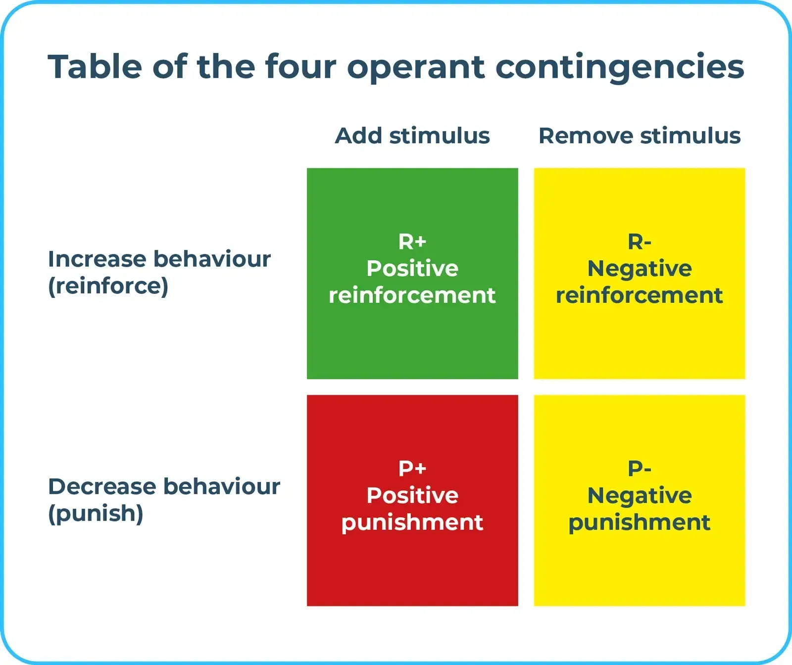

### Are you a force-free trainer or balanced trainer? The very question epitomises the sorry state of the dog training industry.

##### Why are dog trainers only confined to two types – Force-free trainers v Balanced dog trainers?

There are two different styles of learning: active and passive. Therefore, force-free or balanced is only relevant to active learning. In most circumstances, it only accounts for around 25% of learning. 75%, or 3/4, of dog training is comprised of passive learning, hence it is mostly irrelevant.

Let's debate these terms and their definitions if they have a standard one.

As seen in the images, the loose definition of a balanced or force-free dog trainer is based on the skinner's operant conditioning quadrants. You are force-free if you operate in quadrants 1 and 4; you are a balanced trainer if you employ all four quadrants selectively.

Now, merely placing stuff in each quadrant is not enough. Taking a dog into a body of water can be a punishment if the dog is afraid, or a pleasure if the dog enjoys it. The same is true with squirting guns; some dogs enjoy playing with them, therefore it becomes a punishment for others who dislike it.

These criteria (force-free and balanced) narrow the scope of dog training and exclude principles from other areas of learning and development. It disregards areas such as [observation conditioning](https://www.sciencedirect.com/topics/psychology/observational-conditioning#:~:text=called%20this%20%E2%80%9Cobservational%20conditioning%E2%80%9D%3A,this%20case%2C%20the%20snake), [associative learning](https://www.sciencedirect.com/topics/biochemistry-genetics-and-molecular-biology/associative-learning#:~:text=Associative%20learning%20is%20the%20process,unconscious%20recognition%20of%20a%20contingency), [latent inhibition](https://www.sciencedirect.com/topics/neuroscience/latent-inhibition), [behaviour management](https://www.whole-dog-journal.com/behavior/your-dogs-behavior-when-to-manage-when-to-train/), and the extensive implications of [neurochemistry](https://www.sciencedirect.com/science/article/abs/pii/0024320579901681), [neurology](https://psycnet.apa.org/record/2007-02060-007), [endocrinology](https://www.sciencedirect.com/science/article/abs/pii/S0739724016300418), [pharmacology](https://avmajournals.avma.org/view/journals/javma/259/10/javma.20.10.0602.xml), evolutionary science, [cultural impact](https://blogs.scientificamerican.com/dog-spies/how-much-are-dogs-influenced-by-local-culture/), [legal obligations](https://www.cps.gov.uk/legal-guidance/dangerous-dog-offences), [systematic desensitisation](https://www.sciencedirect.com/science/article/abs/pii/S0005796719302189), [environmental impact](https://www.researchgate.net/publication/299131634_Social_rearing_environment_influences_dog_behavioral_development), [bonding](https://www.science.org/content/article/how-dogs-stole-our-hearts#:~:text=New%20research%20shows%20that%20when,companions%20thousands%20of%20years%20ago) (human to human; dog to dog), and [food enrichment](https://web.archive.org/web/20221206081800/https://vet.purdue.edu/discovery/croney/files/documents/enrichment.pdf), among others.

There is a great deal more to dog training than the futile debates and libellous comments we generally see.

It's because we employ terminology with extremely vague definitions, such as balanced trainer and force-free trainer, to sell social media likes for some businesses (Facebook Algorithms). The industry insiders prevent any substantially suggested legislation or implementation of rules (a post for another day).

Let us call it what it is - dog abuse (inflicting pain by chokers, prongs, electrocuting, beating or so on) and dog training for training the dog with compassion. Let's not get lost in unscientific terms narrowing the scope of dog training. Otherwise, balanced only lead to a conclusion that the trainer is allowed to abuse the dog - off course it is not the case for most dog professionals.

There is a reason why no dog trainer course offered in the United Kingdom (with the exception of university programmes) is OFQUAL-accredited or approved for public funding. The inference speaks volumes about the profession, and in contrast to dog grooming, young people cannot get public funding to obtain an Ofqual certificate, such as dog groomers, plumbers, electricians, or any other NVQ, to begin their careers as dog trainers.

OFQUAL will not accredit any dog trainer course provider's training credentials. Therefore, like anyone can be a dog trainer, anybody can start a shop with a charter on the website and an online course considerably below Ofqual's criteria to provide a level 3/4/5 and a database of registered trainers that appears to provide legitimacy. Ofqual has no say in it. All of these signs and emblems reflects self-regulation in effect.

We never hear these terms in the teaching profession - force-free teacher or a balanced teacher for our kids. It is because teachers have QTS standards through Ofqual regulated qualifications.

We do not imply that dog training colleges are redundant but the opposite that they are very important to ignore; we would like to see the training colleges go one step further and become approved by Ofqual. Therefore; providing a proper career path for the younger generation, a standardised acceptable level of teaching and education, rigorous checks and balances on the teaching quality, an approved curriculum, and the list goes on.

- All members of my staff are force-free, but I do not identify with either category, as both are fallacious.
- If the law requires me to muzzle a dog in public against its will, you may consider me a balanced trainer. (quadrant 3/4)
- If the law requires me to keep a dog on a leash in public against the dog's will, you can consider me a balanced trainer. (quadrant 3/4)
- If animal welfare standards require that I cut a dog's nails against its will, you may consider me a balanced trainer. (quadrant 3/4)
- If the law requires me to drive dogs in a confined space or on a tether against their will, you may consider me a balanced trainer. (quadrant 3/4)
- If I think it is important that the puppy is crate trained, you may consider me a balanced trainer. (quadrant 3/4)

It is how you view the use of quadrant in a given set of circumstances rather than generalising them for beating the dog up, electrocuting the dog, choking the dog, wrestling with the dog (it is simply described as abuse). It is a subtle difference which comes with experience and research and makes a difference in a complex case.

No trainer is strictly force-free unless they are dealing with a dog with no restrictions, and the only way to control the dog is by using positive reinforcement - toys, treats or, primary reinforcers and secondary reinforcers. Imagine going on a walk with no lead but only treats in your hand so no force is transferred via leash to the dog during the walk.

Sometimes force-free trainers also use positive punishment, i.e. taking away something the dog enjoys – taking a toy/chew away to get the behaviour and giving it back to reinforce it. This approach, in some cases, can lead to resource guarding or may not be used with dogs suffering from resource guarding. Therefore, confining force-free to one quadrant only – positive reinforcement. It comes back to the same argument again – can you confine your approach to positive only – what about a dog wanting to run in a café; bus journey; pub; or town centre walking; you have to put the dog on a lead to comply with the law (to add restriction and decrease the freedom to run around).

Putting a dog or a puppy on a leash can be considered a balanced trainer approach as you are taking away the dog/puppy's freedom (which he dearly enjoys) or adding a restriction he doesn't like. Taking away the dog's freedom he enjoys by putting a lead on will be considered a positive punishment per skinners quadrants. Adding something which a dog doesn't love decreases a behaviour. Unless the dog loves and enjoys being on the leash (unlikely considering evolutionary science).

Very few dogs enjoy nail clipping and are trained from a very young age. Still, one wrong move with a nail clipper, which touches a quick (blood capillary in nails) or slashes it, will undo positive reinforcement and make the nail clipping negative punishment—adding something the dog doesn't enjoy to reduce the behaviour (nail clipping nicking quick but done after that; to get compliance for nail clipping).

Any dog trainer advertising to be force-free is either putting ideology above children's safety by refusing to put a muzzle on a bite risk dog in a family with kids, or they are false advertising because putting a muzzle on is anything but force-free from a dogs point of view. They may have buried their heads in sand as they mostly train puppies and preach ideology. Alternatively, they use this as marketing tactics to lure the clients in. In clinical terms, putting a dog on the lead is a use of force to restrain the dog's movement - hence, no training is force free!

Another important question arises; How would a force-free trainer train a dog under the magistrate's CDO - contingent destruction order? CDO is usually imposed on those dogs who have previously bitten humans. Either they seek to break the law by training without a muzzle to stick to their ideology, or they are not force-free. It is just a marketing front. Alternatively, they are not experienced enough to touch those cases and give you a classic answer - seek help from a veterinary behaviourist. You will be lucky if you can find a vet nowadays let alone a vet dog trainer. Talentless people holding back the development of the profession as they seek to peddle social media likes on a one size fit dog training - force-free (without understanding the terms force-free).

I never suggest inflicting pain, exceeding the dog's threshold for coping or placing puppies in an environment where they learn to be reactive. We teach the dog using research and scientific methodology. Through science direct, we pay substantial fees to access the veterinary behaviour journal and behaviour science publications.

There is the same old approach in the industry - hiding dog abuse under the terms such as balanced training and keep peddling social media likes with force-free posts.

If you are a true champion of dog welfare – you can take tangible actions such as putting a written complaint to the council for licensed premises. We are the only dog trainers in the area who have any kind of independent oversight through council licensing for our business – doggy day school.

You can even go further for improving dog welfare as a community champion by writing to your MP, form lobby groups, form advocacy groups, form community support for free access to dog training, encourage young people to enter the profession, engage in intellectual debates by highlighting the latest research. Engaging in the social media circus, keep hiding abuse with words such as balanced trainer and others keep peddling force-free advice to gain social media for their business interest.

We should inform and educate, but also more importantly, we must push for a dog trainers' training provider to get OFQUAL approved.

*The above blog is the personal opinion of Kam.*
