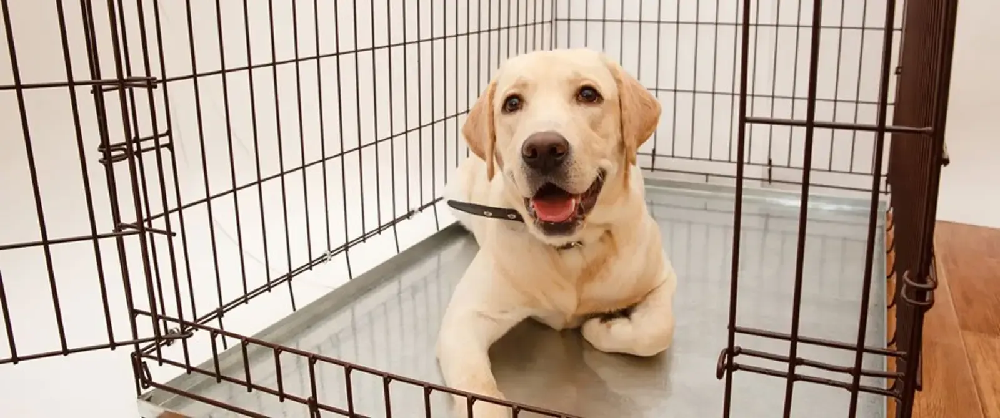

Crate training your dog may take some time and effort but can be useful in various situations. If you have a new dog or puppy, you can use the crate to limit his access to the house until he learns all the house rules – like what he can and can't chew on and where he can and can't eliminate.

A crate is also a safe way of transporting your dog in the car, as well as a way of taking him places where he may not be welcome to run freely. If you properly train your dog to use the crate, he'll think of it as his safe place and will be happy to spend time there when needed.

## Selecting a crate

Crates will be plastic (often called flight kennels or Vari-Kennels) or collapsible, metal pens. They come in different sizes and can be purchased at most pet supply stores. Your dog's crate should be just large enough for him to stand up and turn around.

## The crate training process

Crate training can take days or weeks, depending on your dog's age, temperament and past experiences. It's important to keep two things in mind while crate training. The crate should always be associated with something pleasant, and training should take place in a series of small steps – don't go too fast.

### Step 1: Introducing your dog to the crate

Put the crate in an area of your house where the family spends much time, such as the family room. Put a soft blanket or towel in the crate. Bring your dog over to the crate and talk to him in a happy tone of voice. Ensure the crate door is securely fastened open, so it won't hit your dog and frighten him.

To encourage your dog to enter the crate, drop some small food treats near it, then just inside the door, and finally, all the way inside the crate. If he refuses to go all the way in at first, that's okay – don't force him to enter. Continue tossing treats into the crate until your dog will walk all the way calmly into the crate to get the food. If he isn't interested in treats, try tossing a favourite toy or different high value meaty food in the crate. This step may take a few minutes or as long as few days.

Start leaving the treats inside the crate without telling the dog so when you are not looking the dog accidentally discover the good stuff in crate. If you notice treats have gone missing, just keep replacing them without telling the dog for next few days to create an associative learning.

### Step 2: Feeding your dog his meals in the crate

After introducing your dog to the crate, begin feeding him his regular meals in the crate. This will create a pleasant association with the crate. If your dog is readily entering the crate when you begin Step 2, put the food dish at the back of the crate. If your dog is still reluctant to enter the crate, put the dish only as far inside as he will readily go without becoming fearful or anxious. Each time you feed him, place the dish a little further back in the crate.

Once your dog is standing comfortably in the crate to eat his meal, you can close the door while he's eating. At first, open the door as soon as he finishes his meal. With each successive feeding, leave the door closed a few minutes longer until he's staying in the crate for 10 minutes or so after eating. If he begins to whine to be let out, you may have increased the length of time too quickly. Next time, try leaving him in the crate for a shorter time period. If he does whine or cry in the crate, it's imperative that you not let him out until he stops. Otherwise, he'll learn that the way to get out of the crate is to whine, so he'll keep doing it.

Do not leave the puppy alone in the crate while he is feeding. Sit next to the crate without interfering with the food or eating as you do not want to create the feeling of losing mummy & daddy as soon as crate is shut thus reluctance to eat inside the crate. Sit next to crate as long as dog is ok to stay in it or around it.

### Step 3: Conditioning your dog to the crate for longer time periods

After your dog is eating his regular meals in the crate with no sign of fear or anxiety, you can confine him there for short time periods while you're home. Call him over to the crate and give him a treat. Give him a command/cue to enter, such as, "go in." Encourage him by pointing to the inside of the crate with a treat in your hand. After your dog enters the crate, praise him, give him the treat and close the door.

Sit quietly near the crate for five to 10 minutes and then go into another room for a few minutes. Return, sit quietly again for a short time, then let him out of the crate. Repeat this process several times a day. With each repetition, gradually increase the length of time you leave him in the crate and the length of time you're out of his sight. Once your dog will stay quietly in the crate for about 30 minutes with you out of sight the majority of the time, you can begin leaving him crated when you're gone for short time periods and/or letting him sleep there at night. This may take several days or several weeks.

### Step 4: Crating your dog

### Part A: Crating your dog when left alone

After your dog is spending about 30 minutes in the crate without becoming anxious or afraid, you can begin leaving him crated for short periods when you leave the house. Put him in the crate using your regular command and a treat. You might also want to leave him with a few safe toys in the crate. You'll want to vary at what point in your "getting ready to leave" routine you put your dog in the crate. Although he shouldn't be crated for a long time before you leave, you can crate him anywhere from five to 20 minutes before leaving. Don't make your departures emotional and prolonged, but matter-of-fact. Praise your dog briefly, give him a treat for entering the crate and then leave quietly. When you return home, don't reward your dog for excited behaviour by responding to him in an excited, enthusiastic way. Keep arrivals low key. Continue to crate your dog for short periods from time to time when you're home so he doesn't associate crating with being left alone. Your dog should not be left alone in the crate for more than four to five hours at a time during the day.

### Part B: Crating your dog at night

Put your dog in the crate using your regular command and a treat. Initially, it may be a good idea to put the crate in your bedroom, next to your bed or nearby in a hallway, especially if you have a puppy. Puppies often need to go outside to eliminate during the night, and you'll want to be able to hear your puppy when he whines to be let outside. Older dogs, too, should initially be kept nearby so that crating doesn't become associated with social isolation. Once your dog is sleeping comfortably through the night with his crate near you, you can begin to gradually move it to the location you prefer.

## Potential problems

### Too much time in the crate

A crate isn't a magical solution. If not used correctly, a dog can feel trapped and frustrated. For example, if your dog is crated all day while you're at work and then crated all night again, he's spending too much time in too small a space. Other arrangements should be made to accommodate his physical and emotional needs. Also, remember that puppies under six months of age shouldn't stay in a crate for more than three or four hours at a time unless night time sleeping. They can't control their bladders and bowels for longer periods.

### Whining

If your dog whines or cries while in the crate at night, it may be difficult to decide whether he's whining to be let out of the crate, or whether he needs to be let outside to eliminate. If you followed the training procedures outlined above, your dog hasn't been rewarded for whining in the past by being released from his crate. Try to ignore the whining (as long as it is not inducing stress). If your dog is just testing you, he'll probably stop whining soon. Yelling at him or pounding on the crate will only make things worse.

If the whining continues after you've ignored him for several minutes, use the phrase he associates with going outside to eliminate. If he responds and becomes excited, take him outside. This should be a trip with a purpose, not playtime. If you're convinced that your dog doesn't need to eliminate, the best response is to ignore him until he stops whining (given he is not stressing himself out). If you've progressed gradually through the training steps and haven't done too much too fast, you'll be less likely to encounter this problem. If the problem becomes unmanageable, you may need to start the crate training process over again.

### Separation anxiety

Attempting to use the crate to remedy separation anxiety won't solve the problem. A crate may prevent your dog from being destructive, but he may injure himself in an attempt to escape from the crate. Separation anxiety problems can only be resolved with counter-conditioning and desensitisation procedures. You may want to consult a professional dog trainer for help.

