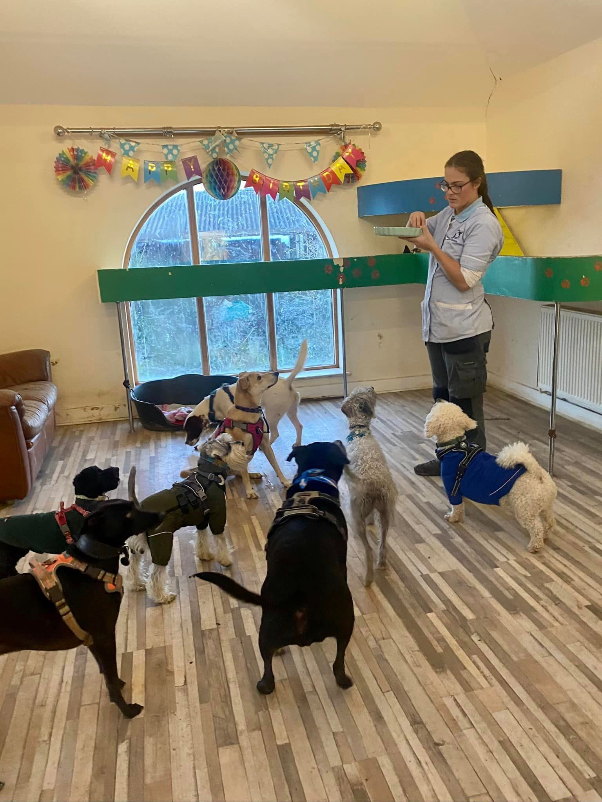
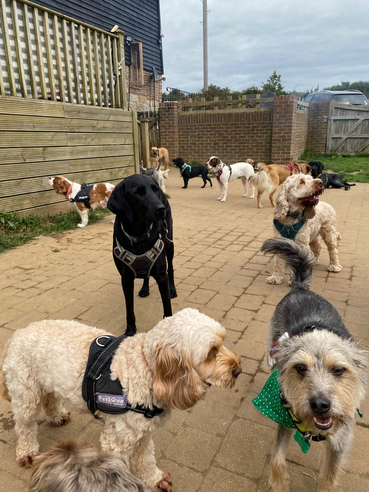

### Introducing a puppy to a dog day care

Introducing a puppy to daycare at a young age isn't just convenient for pet owners; it's a crucial step in nurturing well-rounded, sociable, and joyful canine companions. In this comprehensive guide, we delve into the multifaceted benefits of early puppy daycare, focusing on routine establishment, enhanced human and puppy socialisation, confidence building, and adaptability development.

**Why Choose Puppy Daycare for Socialisation and Health?**

**Comprehensive Socialisation at Puppy Daycare**

At Fairy Tails Puppy Daycare in Hastings, we don't just watch over your puppies; we guide them through a journey of meaningful social interactions and learning. Our daycare stands as an exemplary setting for comprehensive socialisation, crucial in shaping well-adjusted adult dogs.

In this nurturing environment, puppies learn much more than just play. They are gradually introduced to a myriad of social cues, helping them interpret various canine body languages and signals. This education is vital, as understanding these subtle forms of communication is key to developing good social skills and preventing misunderstandings among dogs.

Our skilled trainers ensure that puppies learn to respect boundaries and engage appropriately with their peers. This interaction isn't limited to just a single breed or size; instead, we expose them to a diverse range of breeds, sizes, and temperaments. Such exposure is instrumental in building a well-rounded canine citizen, capable of interacting confidently and calmly in different social scenarios.

We firmly believe that early socialisation is the cornerstone of preventing behavioural issues such as fear, aggression, or anxiety in puppies. By encountering a variety of situations in a safe and controlled environment, puppies learn to navigate the world with confidence. These early experiences are not just about preventing negative behaviours but also about fostering positive traits like empathy, patience, and adaptability.

At Fairy Tails, our goal is to lay a strong foundation for each puppy's social development. We create a space where they can explore, learn, and grow into well-behaved, sociable dogs. This commitment to comprehensive socialisation is our promise to you and a gift to your furry family member, ensuring they lead a happy, healthy, and socially enriched life.

Effective Energy Management for Puppy Health

Effective Energy Management for Puppy Health At our daycare, we don't just oversee playtime; we engineer it for optimal puppy health and happiness. Structured playtime and activities are meticulously planned to cater to both the physical and mental stimulation needs of your growing puppy. This thoughtful approach promotes better health and more balanced behaviour, which is especially crucial for puppies in their formative stages. Understanding that puppies possess boundless energy and curiosity, our professional dog trainers design activities that channel these traits into positive, health-enhancing experiences. Our play sessions are interspersed with rest periods, ensuring that your puppy's energy is expended in a healthy, controlled manner, avoiding overstimulation. The activities vary from interactive games that boost physical fitness to cognitive challenges that sharpen their mental faculties. These exercises are not only fun but also instrumental in building a foundation for well-behaved, sociable adult dogs. By engaging in these structured activities, puppies learn essential social cues and behaviours, which are critical for their overall development.

**Exposure to Varied Environments for Puppy Development**

Our daycare is a melting pot of experiences, vital for nurturing a puppy's adaptability. Regular exposure to varied environments and stimuli is key to their development. This diversity ranges from different sounds and sights to varied textures and scents, all within a safe and controlled setting. Such exposure equips puppies with the confidence to navigate new situations with ease, laying the groundwork for a well-adjusted, fearless adult dog. It's not just about acclimatisation; it's about building confident explorers for life.

**Routine Establishment for Behavioural Training**

Our daycare emphasises the power of a consistent routine in fostering a sense of security and aiding behavioural training. By maintaining a structured schedule, we minimise confusion and anxiety in puppies, which is pivotal for their emotional well-being. This consistency plays a crucial role in quicker house training, as puppies learn to anticipate and adapt to regular feeding, play, and rest times. A predictable routine not only instils a sense of security but also lays a strong foundation for future training and discipline.

**Enhanced Human Socialisation for Puppies**

At our daycare, regular interaction with a diverse range of humans is a cornerstone of our program, vital for building a puppy's trust and comfort with people. This varied human contact, ranging from our caring staff to different visitors, plays a significant role in enhancing a puppy's social development. It teaches them to be comfortable and confident around various people, laying the groundwork for a well-socialised, friendly adult dog who can adapt seamlessly to human-centric environments.

Developing Adaptability in Puppies

Our daycare is more than just a fun place; it's a training ground for adaptability. Puppies attending our facility consistently show an enhanced ability to adjust to new environments, an essential skill for urban living or families who travel frequently. By exposing them to a variety of settings and experiences, we equip them with the resilience and flexibility needed to confidently face the diverse challenges of modern lifestyles, ensuring they grow into adaptable, well-adjusted dogs.

**Fostering Independence in Puppies**

Daycare plays a pivotal role in nurturing independence in puppies, an essential step in their development. By providing a space where they can spend time away from their owners in a safe and supportive environment, daycare helps significantly reduce the risk of separation anxiety. This independence training teaches puppies to be comfortable and self-assured even when alone, ensuring they develop into well-rounded, confident dogs. It’s not just about giving owners a break; it’s about instilling a healthy sense of self-reliance in our canine companions.

**Long-Term Behavioural Benefits**

The experiences puppies gain at daycare extend far beyond immediate enjoyment; they lay the foundation for long-term behavioural benefits. Regular interaction, diverse experiences, and structured routines contribute to shaping more manageable and receptive adult dogs. This early exposure to varied stimuli and socialisation opportunities equips them with the skills to navigate the world with ease, leading to well-adjusted dogs who are adaptable, sociable, and responsive to training. It's an investment in their future, ensuring a lifetime of positive behaviours and harmonious human-dog relationships.

**Safe Growth Environment**

Our daycare offers more than just fun and learning; it's a haven of safety. By providing a controlled environment, we significantly reduce the risk of accidents, ensuring that your puppy's growth and exploration happen within the bounds of a secure space. Our vigilant supervision, coupled with thoughtfully designed play areas, means that risks are minimised. This attention to safety allows puppies to freely discover and develop without the hazards they might encounter in less controlled settings, making our daycare a secure foundation for their growth and well-being.

**Observational Opportunities for Staff**

The attentive eyes of our daycare staff are not just for ensuring safety; they are key in understanding each puppy's unique temperament. Through regular observation, our staff gain valuable insights into a puppy's behaviour, social interactions, and learning patterns. This in-depth understanding allows them to identify potential areas for improvement and provide personalised guidance. These observations are shared with owners, offering a more comprehensive view of their puppy's development and suggesting tailored strategies for further training and growth. It's a partnership aimed at bringing out the best in every puppy.

**Support for Working Pet Parents**

Our daycare stands as a vital support system for working pet parents. We understand the stress and worry that come with leaving puppies alone for long periods. By providing a nurturing and engaging environment for your puppy, we alleviate these concerns. You can focus on your workday knowing that your puppy is not just safe but also thriving, socialising, and learning in a loving setting. This support extends beyond physical care; it’s about giving you peace of mind and ensuring that your bond with your puppy remains strong, even when life gets busy.

**Long-lasting Friendships**

Daycare is more than a place for play; it's a breeding ground for long-lasting friendships. In this social hub, puppies have the unique opportunity to form significant bonds with their peers. These early friendships play a crucial role in their social development, teaching them about cooperation, empathy, and the joys of companionship. The connections made here often extend beyond the daycare walls, as puppies who grow up together build a foundation for enduring social bonds. These relationships enrich their lives, offering comfort, play, and mutual understanding as they journey

**Conclusion**

Choosing to introduce your puppy to daycare is a transformative decision, one that significantly influences their overall development. At Fairy Tails Dog Daycare in Hastings, we are committed to shaping young canines into sociable, adaptable, and confident adult dogs. The benefits of our daycare extend far beyond mere convenience; they lay the cornerstone for a happy, well-adjusted life for your furry family member.

To explore how your puppy can thrive with our specialised daycare services, visit us at [www.thefairytails.co.uk](/). For a more personal touch, feel free to call us at 01424 300668. Together, we can embark on this enriching journey, fostering a bright, joyful, and healthy future for your beloved puppy. Let's nurture their potential and watch them flourish in the loving environment of Fairy Tails Daycare.

